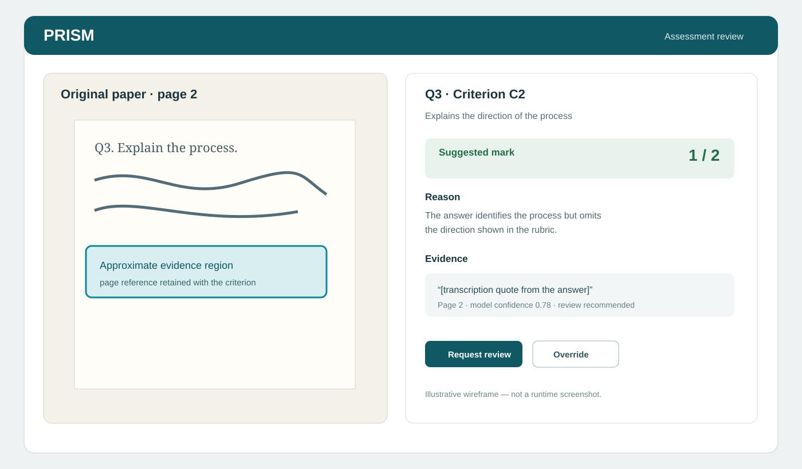
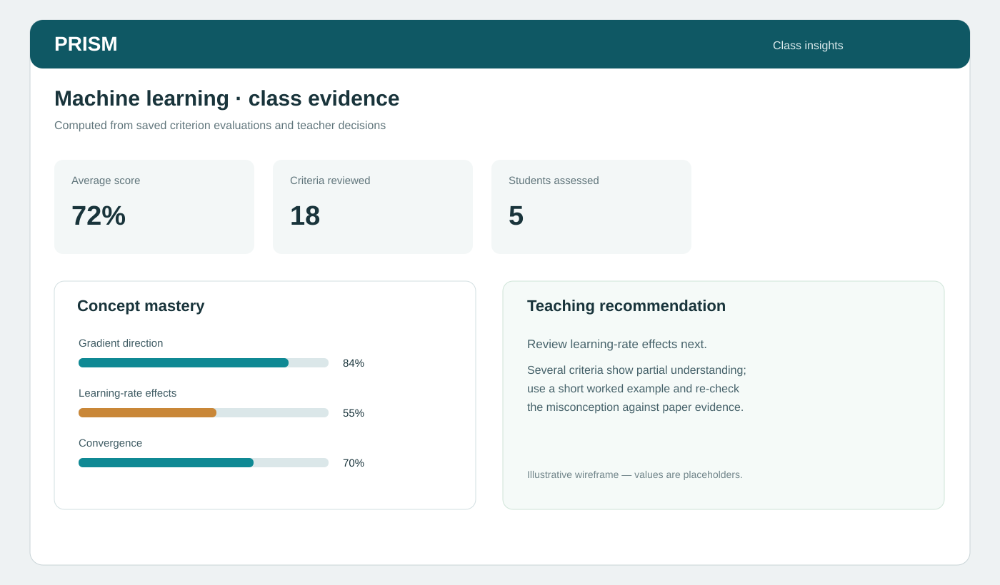

# Screenshots and visual evidence

## Current capture status

The source checkout was inspected against the latest fetched commit, but a
browser automation surface was unavailable during this documentation pass. To
avoid presenting invented UI as runtime evidence, this refresh includes two
clearly labeled wireframes and a repeatable capture checklist. Replace the
wireframes with real captures when a browser is available.

These files are **illustrative documentation assets**, not screenshots of a
deployed environment:

## Capture checklist

Use the teacher side of a safe local or staging environment. Do not publish
passwords, session cookies, API keys, personal student data, or private paper
images.

| Frame | Route | What it should prove |
| --- | --- | --- |
| 01 | `/login` | Teacher sign-in surface |
| 02 | `/exams/new` | Question and rubric authoring |
| 03 | `/exams/:id` | Paper page selection and preview |
| 04 | `/submissions/:id` | Original page, transcription, evidence, confidence |
| 05 | `/submissions/:id` | Review suggestion before teacher decision |
| 06 | `/submissions/:id` | Override/history distinction |
| 07 | `/students/:id` | Evidence-backed student profile |
| 08 | `/classes/:id` | Class concepts and aggregate statistics |
| 09 | `/assistant` | Grounded teacher question and answer |

## Capture procedure

1. Record the app version or commit SHA.
2. Seed synthetic data or use a consented test account.
3. Capture at a consistent viewport, preferably 1440 × 900 or a documented
   equivalent.
4. Keep the browser URL visible only if it contains no secret or private host.
5. Crop or redact emails, student identifiers, paper images, and signed URLs.
6. Name images by workflow and sequence, for example
   `04-evidence-review.png`.
7. Add a one-line caption describing what is visible and whether it is live,
   seeded, or cached.
8. Recheck that no password appears in the image, filename, alt text, or
   commit message.

## Evidence captions

Use captions that distinguish the evidence type:

- **Live capture:** taken from a running build at a stated commit.
- **Seeded capture:** running UI populated by deterministic demo data.
- **Cached capture:** previously processed result used for demo continuity.
- **Illustrative wireframe:** documentation-only representation, not runtime
  evidence.
